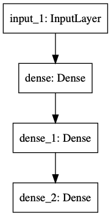
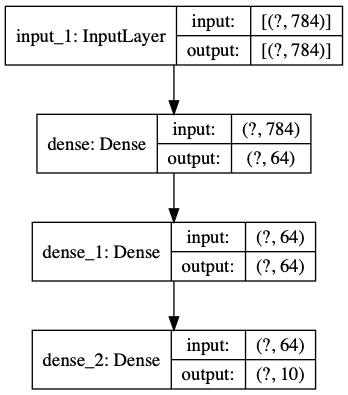

.. _header-n0:

TF-keras-functional-API
=======================

.. _header-n3:

Keras functional API
--------------------

The Functional API is a set of tools for **building graphs of layers**.

.. _header-n5:

1. 一个示例
~~~~~~~~~~~

   -  建立一个包含 2 个隐藏层的神经网络.

.. code:: python

   from __future__ import absolute_import, division, print_function, unicode_literals
   import tensorflow as tf
   from tensorflow import keras
   from tensorflow.keras import layers
   tf.keras.backend.clear_session()

数据预处理：

.. code:: python

   (x_train, y_train), (x_test, y_test) = keras.datasets.mnist.load_data()
   x_train = x_train.reshape(60000, 784).astype("float32") / 255
   x_test = x_test.reshape(10000, 784).astype("float32") / 255

构建模型：

.. code:: python

   # Inputs
   inputs = keras.Input(shape = (784,))
   print(inputs.shape)
   print(inputs.dtype)
   # img_inputs = keras.Input(shape = (32, 32, 3))
   # print(img_inputs.shape)
   # print(img_inputs.dtype)

   # Layers and Model
   x = layers.Dense(64, activation = "relu")(inputs)
   x = layers.Dense(64, activation = "relu")(x)
   outputs = layers.Dense(10, activation = "softmax")(x)
   model = keras.Model(inputs = inputs, outputs = outputs, name = "mnist_model")
   print(model.summary())

.. code:: python

   keras.utils.plot_model(model, "my_first_model.png")

.. code:: python

   keras.utils.plot_model(model, "my_first_model_with_shape_info.png", show_shapes = True)

模型编译：

.. code:: python

   model.compile(loss = "sparse_categorical_crossentropy",
   			  optimizer = keras.optimizers.RMSprop(),
   			  metrics = ["accuracy"])

模型训练：

.. code:: python

   history = model.fit(x_train, y_train, batch_size = 64, epochs = 5, validation_split = 0.2)

模型评估：

.. code:: python

   test_scores = model.evaluate(x_test, y_test, verbose = 0)
   print("Test loss:", test_scores[0])
   print("Test accuracy:", test_scores[1])

模型保存和序列化：

-  保存的模型文件包含：

   -  model's architecture

   -  model's weight value

   -  model's training config

.. code:: python

   model.save("path_to_my_model.h5")
   del model
   model = keras.models.load_model("path_to_my_model.h5")

.. _header-n37:

2. 使用相同的图层定义多个模型
-----------------------------

.. code:: python

   # encoder model
   encoder_input = keras.Input(shape = (28, 28, 1), name = "img")
   x = layers.Conv2D(16, 3, activation = "relu")(encoder_input)
   x = layers.Conv2D(32, 3, activation = "relu")(x)
   x = layers.MaxPooling2D(3)(x)
   x = layers.Conv2D(32, 3, activation = "relu")(x)
   x = layers.Conv2D(16, 3, activation = "relu")(x)
   encoder_output = layers.GlobalMaxPooling2D()(x)
   encoder = keras.Model(encoder_input, encoder_output, name = "encoder")
   encoder.summary()

   # autoencoder model
   x = layers.Reshape((4, 4, 1))(encoder_output)
   x = layers.Conv2DTranspose(16, 3, activation = "relu")(x)
   x = layers.Conv2DTranspose(32, 3, activation = "relu")(x)
   x = layers.UpSampling2D(3)(x)
   x = layers.Conv2DTranspose(16, 3, activation = "relu")(x)
   decoder_output = layers.Conv2DTranspose(1, 3, activation = "relu")(x)
   autoencoder = keras.Model(encoder_input, decoder_output, name = "autoencoder")
   autoencoder.summary()

.. _header-n40:

3. All models are callable, just like layers
--------------------------------------------

-  一个自编码器(autoencoder)

.. code:: python

   encoder_input = keras.Input(shape = (28, 28, 1), name = "original_img")
   x = layers.Conv2D(16, 3, activation = "relu")(encoder_input)
   x = layers.Conv2D(32, 3, activation = "relu")(x)
   x = layers.MaxPooling2D(3)(x)
   x = layers.Conv2D(32, 3, activation = "relu")(x)
   x = layers.Conv2D(16, 3, activation = "relu")(x)
   encoder_output = layers.GlobalMaxPooling2D()(x)
   encoder = keras.Model(encoder_input, encoder_output, name = "encoder")
   encoder.summary()

   decoder_input = keras.Input(shape = (16,), name = "encoder_img")
   x = layers.Reshape((4, 4, 1))(decoder_input)
   x = layers.Conv2DTranspose(16, 3, activation = "relu")(x)
   x = layers.Conv2DTranspose(32, 3, activation = "relu")(x)
   x = layers.UpSampling2D(3)(x)
   x = layers.Conv2DTranspose(16, 3, activation = "relu")(x)
   decoder_output = layers.Conv2DTranspose(1, 3, activation = "relu")(x)
   decoder = keras.Model(decoder_input, decoder_output, name = "decoder")
   decoder.summary()

   autoencoder_input = keras.Input(shpae = (28, 28, 1), name = "img")
   encoder_img = encoder(autoencoder_input)
   decoded_img = decoder(encoder_img)
   autoencoder = keras.Model(autoencoder_input, decoded_img, name = "autoencoder")
   autoencoder.summary()

.. _header-n45:

4. 操作复杂图拓扑
-----------------

-  多输入和多输出模型

.. code:: python
   
   import tensorflow

.. _header-n51:

5. 何时使用 Functional API
--------------------------

-  Functional API is higher-level, earier & safer to use

   -  Functional API 的强势

      -  less verbose: no ``super(MyClass, self).__init__()``, no
         ``def call(self, ...):``, etc

      -  

   -  Functional API 的弱势

-  Functional API has a number of features that subclassed Models do not
   support

-  Model subclassing gives you greater flexibility when creating models
   that are not easily expressible as directed acyclic graphs of layers

Functional API:

.. code:: python

   import tensorflow as tf

Subclassed Models:

.. code:: python

   import tensorflow as tf

.. _header-n75:

6. 不同风格 APIs 混合和配合使用
-------------------------------

-  Sequential models

-  Functional models

-  subclassed Models/Layers written from scratch

.. code:: python

   units = 32
   timesteps = 10
   input_dim = 5

   # 定义一个 Functional model
   inputs = keras.Input((None, units))
   x = layers.GlobalAveragePooling1D()(inputs)
   outputs = layers.Dense(1, activation = "sigmoid")(x)
   model = keras.Model(inputs, outputs)

   class CustomRNN(layers.Layer):

   	def __init__(self):
   		super(CustomRNN, self).__init__()
   		self.units = units
   		self.projection_1 = layers.Dense(units = units, activation = "tanh")
   		self.projection_2 = layers.Dense(units = units, activation = "tanh")
   		self.classifier = model

   	def call(self, inputs):
   		outputs = []
   		state = tf.zeros(shape = (inputs.shape[0], self.units))
   		for t in range(inputs.shape[1]):
   			x = inputs[:, t, :]
   			h = self.projection_2(x)
   			y = h + self.projection_2(state)
   			state = y
   			outputs.append(y)
   		features = tf.stack(outputs, axis = 1)
   		print(features.shape)
   		
   		return self.classifier(features)

   rnn_model = CustomRNN()
   _ = rnn_model(tf.zeros((1, timesteps, input_dim)))
