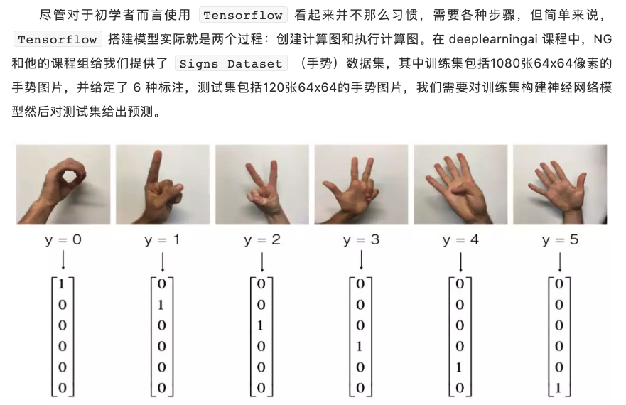

.. _header-n0:

TensorFlow-MNIST-CNN
====================

步骤：

-  定义网络结构

   -  指定输入层、隐藏层、输出层的大小

-  初始化模型参数

-  循环操作：执行前向传播 => 计算当前损失 => 执行反向传播 => 权值更新

   -  执行前向传播

   -  计算当前损失

   -  执行反向传播

   -  权值更新

.. _header-n24:

data
----

.. code:: python

   import numpy as np
   import matplotlib.pyplot as plt
   import tensorflow as tf

.. code:: python

   X_train = X_train_orig / 255.
   X_test = X_test_orig / 255.
   Y_train = convert_to_one_hot(Y_train_orig, 6).T
   Y_test = convert_to_one_hot(Y_test_orig, 6).T
   print ("number of training examples = " + str(X_train.shape[0]))
   print ("number of test examples = " + str(X_test.shape[0]))
   print ("X_train shape: " + str(X_train.shape))
   print ("Y_train shape: " + str(Y_train.shape))
   print ("X_test shape: " + str(X_test.shape))
   print ("Y_test shape: " + str(Y_test.shape))

.. code:: python

   def create_placeholders(n_H0, n_W0, n_C0, n_y):
       """
       Arguments:
           n_H0: scalar, height of an input image
           n_W0: scalar, width of an input image
           n_C0: scalar, number of channels of the input
           n_y: scalar, number of classes
       Returns:
           X: placeholder for the data input of shape [None, n_H0, n_W0, n_C0] and dtype "float"
           Y: placeholder for the input labels of shape [None, n_y] and dtype "float"
       """
       X = tf.placeholder(tf.float32, shape = (None, n_H0, n_W0, n_C0), name = "X")
       Y = tf.placeholder(tf.float32, shape = (None, n_y), name = "Y")
       return X, Y

.. _header-n31:

1.参数初始化
------------

.. code:: python

   def initialize_parameters():
       tf.set_random_seed(1)
       W1 = tf.get_variable(name = "W1", 
                            shape = [4, 4, 3, 8], 
                            initializer = tf.contrib.layers.xavier_initializer(seed = 0))
       W2 = tf.get_variable(name = "W2", 
                            shape = [2, 2, 8, 16], 
                            initializer = tf.contrib.layers.xavier_initializer(seed = 0))
       parameters = {
           "W1": W1,
           "W2": W2
       }
       return parameters

.. _header-n34:

2.循环操作
----------

前向传播:

-  :math:`Conv2D -> ReLU -> MaxPool -> Conv2D -> ReLU -> MaxPool -> Flatten -> FullyConnected`

.. code:: python

   def forward_propagation(X, parameters):
       W1 = parameters["W1"]
       W2 = parameters["W2"]
       # Conv2D: filter W1, stride of 1, padding "SAME"
       # ReLU
       # MaxPool: window 8x8, stride of 8, padding "SAME"
       Z1 = tf.nn.conv2d(X, W1, strides = [1, 1, 1, 1], padding = "SAME")
       A1 = tf.nn.relu(Z1)
       P1 = tf.nn.max_pool(A1, ksize = [1, 8, 8, 1], strides = [1, 8, 8, 1], padding = "SAME")
       # Conv2D: filter W2, stride of 1, padding "SAME"
       # ReLU
       # MaxPool: window 4x4, stride of 4, padding "SAME"
       Z2 = tf.nn.conv2d(P1, W2, strides = [1, 1, 1, 1], padding = "SAME")
       A2 = tf.nn.relu(Z2)
       P2 = tf.nn.max_pool(A2, ksize = [1, 4, 4, 1], strides = [1, 4, 4, 1], padding = "SAME")
       # Flatten
       P2 = tf.contrib.layers.flatten(P2)
       Z3 = tf.contrib.layers.full_connected(P2, 6, activation_fn = None)
       return Z3

计算前向损失：

.. code:: python

   def compute_cost(Z3, Y):
       cost = tf.reduce_mean(
           tf.no.softmax_cross_entropy_with_logits(logtis = Z3, labels = Y)
       )
       return cost

封装模型：

.. code:: python

   def model(X_train, Y_train, X_test, Y_test, 
             learning_rate = 0.009, num_epochs = 100, 
             minibatch_size = 64, print_cost = True):
       
       # configuration
       ops.reset_default_graph()
       tf.set_random_seed()
       seed = 3
       (m, n_H0, n_W0, n_C0) = X_train.shape
       n_y = Y_train.shape[1]
       costs = []

       # Create placeholders of the correct shape
       X, Y = create_placeholders(n_H0, n_W0, n_C0, n_y)
       # Initialize parameters
       parameters = initialize_parameters()
       # Forward propagation
       Z3 = forward_propagation(X, parameters)
       # Cost function
       cost = compute_cost(Z3, Y)
       # Backpropagation
       optimizer = tf.train.Adamoptimizer(learning_rate = learning_rate).minimize(cost)
       init = tf.global_variables_initializer()
       
       # Start the session to compute the tensorflow graph
       with tf.Session() as sess:
           sess.run(init)
           for epoch in range(num_epochs):
               minibatch_cost = 0.0
               num_minibatches = int(m / minibatch_size)
               seed += 1
               minibatches = random_mini_batches(X_train, Y_train, minibatch_size, seed)
               for minibatch in minibatches:
                   (minibatch_X, minibatch_Y) = minibatch
                   _, temp_cost = sess.run([optimizer, cost], feed_dict = {X: minibatch_X, 
                                                                           Y: minibatch_Y})
                   minibatch_cost += temp_cost / num_minibatches
               if print_cost == True and epoch % 5 == 0:
                   print("Cost after epoch %i: %f" % (epoch, minibatch_cost))
               if print_cost == True and epoch % 1 == 0:
                   costs.append(minibatch_cost)
           plt.plot(np.squeeze(costs))
           plt.ylabel("cost")
           plt.xlabel("iterations (per tens)")
           plt.title("Learning rate =" + str(learning_rate))
           plt.show()

           # Calculate the correct predictions
           predict_op = tf.argmax(Z3, 1)
           correct_prediction = tf.equal(predict_op, tf.argmax(Y, 1))

           # Calculate accuracy on the test set
           accuracy = tf.reduce_mean(tf.cast(correct_prediction, "float"))
           print(accuracy)
           train_accuracy = accuracy.eval({X: X_train, Y: Y_train})
           test_accuracy = accuracy.eval({X: X_test, Y: Y_test})
           print("Train Accuracy:", train_accuracy)
           print("Test Accuracy:", test_accuracy)

       return train_accuracy, test_accuracy, parameters

.. code:: python

   _, _ = parameters = model(X_train, Y_train, X_test, Y_test)
