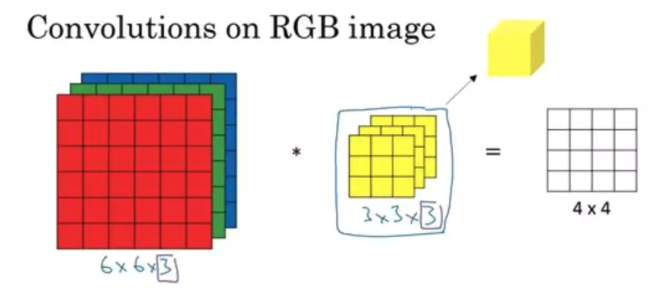
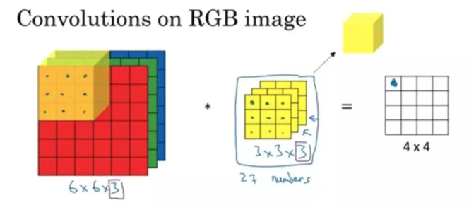
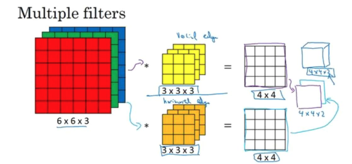

CNN
=========

.. _header-n3:

1. CNN 发展历史
---------------

   CNN 在计算机视觉的三大领域：**图像识别** 、**目标检测**、**语义分割(图像分割)** 有着广泛的应用.

   1985年，Rumelhart 和 Hinton 等人提出了 **BP神经网络** (`Learning internal representations by error propagation, 1985
   <https://web.stanford.edu/class/psych209a/ReadingsByDate/02_06/PDPVolIChapter8.pdf>`_)，
   即著名的反向传播算法训练神经网络模型，奠定了神经网络的理论基础.

   深度学习三巨头（Yann LeCun, Geoffrey Hinton, Yoshua Bengio） 之一 Yann LeCun 在 BP 神经网络提出之后三年，
   发现可以用 BP 算法训练一种构造出来的多层卷积网络结构，并用其训练出来的卷积网络识别手写数字。
   在 (`Backpropagation applied to handwritten zip code recognition，1989 <http://yann.lecun.com/exdb/publis/pdf/lecun-89e.pdf>`_) 一文中，
   LeCun 正式提出了 **卷积神经网络(Convolutional Neural Network,CNN)** 的概念.

   LeCun 正式提出 CNN 概念之后，在 1998年 提出了 CNN 的开山之作 —— **LeNet-5 网络** (`Gradient-based learning applied to document recognition，1998
   <http://yann.lecun.com/exdb/publis/pdf/lecun-01a.pdf>`_).

   进入21世纪后，由于计算能力和可解释性等多方面的原因，神经网络的发展经历了短暂的低谷，直到 2012 年 ILSVRC 大赛上 **AlexNet** 一举夺魁，
   此后大数据兴起，以 CNN 为代表的深度学习方法逐渐成为计算机视觉、语音识别和自然语言处理等领域的主流方法，CNN 才开始正式发展起来。

.. _header-n9:

2. CNN 结构、原理
-----------------

.. _header-n10:

2.1 CNN 整体结构
~~~~~~~~~~~~~~~~

   -  全连接的神经网络或 DNN 中，Affine 层后面跟着激活函数 ReLU 层。最后是 Affine 层加 Softmax 层输出最终结果(概率)

      -  全连接层存在的问题：

         - 因为图像是3维的，这个形状应该含有重要的空间信息。比如，空间上相邻的像素为相似的值、RGB 的各个通道之间分别有密切
           的关联性、相距较远的像素之间没有什么关联等

         - 全连接层会忽略数据的形状，它会将输入数据作为相同的神经元（同一维度的神经元）处理，所以无法利用与形状相关的信息

   - 一个典型的 CNN 通常包括下面这三层：

      - **卷积层(Convolutional layer)**

         - CNN 相较于 DNN，其主要区别就在于 **卷积层(Convolutional layer)**，
           卷积层的存在使得神经网络具备更强的学习和特征提取能力

         - 卷积层可以保持数据形状不变，当输入数据是图像时，卷积层会以 3 维数据的形式接收输入数据，
           并同样以3维数据的形式输出至下一层。因此，在 CNN 中，可以正确理解图像等具有形状的数据

      - **池化层(Pooling layer)**

         - CNN 中在卷积层后面会跟着一个 **池化层(Pooling layer)**，池化层的存在使得 CNN 的稳健性更好

      - **全连接层(Full Connected layer)**

         - CNN 的最后是 DNN 中常见的 **全连接层(Full Connected layer)**

.. _header-n43:

2.2 卷积层(Convolutional layer)
~~~~~~~~~~~~~~~~~~~~~~~~~~~~~~~~

2.2.1 卷积定义
^^^^^^^^^^^^^^^

   - 从数学的角度解释，卷积可以理解为一种类似于 **加权运算** 一样的操作。在图像处理中，针对图像的像素矩阵，
     **卷积操作就是用一个卷积核来逐行逐列的扫描像素矩阵，并与像素矩阵做元素相乘，以此得到新的像素矩阵**，
     这个过程称为 ``卷积(Convolutional)``. 其中

      -  卷积核也叫作 ``过滤器`` 或者 ``滤波器(filter)``

      -  滤波器在输入的像素矩阵上扫过的面积称为 ``感受野()``

      -  卷积层的输入输出数据称为 ``特征图(feature map)``
      
         - 卷积层的输入数据称为 ``输入特征图``
         
         - 卷积层的输出数据称为 ``输出特征图``

2.2.2 卷积计算
^^^^^^^^^^^^^^^

   .. image:: ../../images/conv.gif

   -  在上面的图中，用一个 :math:`3 \times 3` 的滤波器扫描一个 :math:`5 \times 5`
      的输入像素矩阵。用滤波器中每一个元素与像素矩阵中感受野内的元素进行乘积运算，可以得到一个
      :math:`3 \times 3` 的输出像素矩阵。这个输出的 :math:`3 \times 3`
      的输出像素矩阵能够较大程度地提取原始像素矩阵的图像特征，这也是卷积神经网络之所以有效的原因

   -  将各个位置上滤波器的元素和输入像素矩阵的对应元素相乘，然后再求和。最后，将这个结果保存到输出的对应位置；
      将这个过程在输入像素矩阵的所有位置都进行一遍，就可以得到卷积运算的输出

2.2.3 卷积步幅
^^^^^^^^^^^^^^^^^^^^^^

   -  应用滤波器的位置的间隔称为 **步幅(Stirde)**

   -  滤波器移动的步幅为 1 时，即滤波器在像素矩阵上一格一格平移, 滤波器也可以以 2 个或更多的单位平移

2.2.4 卷积输出维度
^^^^^^^^^^^^^^^^^^

   - 如何确定经过卷积后的输出矩阵的维度？

   - 假设原始输入像素矩阵中: :math:`shape = (n, n)`，滤波器: :math:`shape = (f, f)`，步幅: :math:`s`

      - 如果滤波器的步幅 :math:`s=1`，那么输出像素矩阵: 
         
         - :math:`shape = (n-f+1, n-f+1)`

      - 如果滤波器的步幅 :math:`s \geq 1`，那么输出像素矩阵: 
      
         - :math:`shape = \Big(\frac{(n-f)}{s+1}, \frac{(n-f)}{s+1}\Big)`

2.2.5 卷积填充
^^^^^^^^^^^^^^^^^^^^^^^^^^

   -  **问题**:

      - 在进行卷积运算时，原始输入像素矩阵的边缘和角落位置的像素点只能被滤波器扫描到一次，
        而靠近像素中心点位置的像素点则会被多次扫描到进行卷积，这使得边缘和角落里的像素特征提取不足；

      -  在 CNN 中进行卷积运算，输出数据的大小会越来越小，反复进行多次卷积运算后，某个时刻的输出大小就有可能变为
         :math:`1 \times 1`，导致无法再应用卷积运算，为了避免这样的情况，就需要使用卷积填充(Padding)，
         可以使得卷积运算在保持空间大小不变的情况下降数据传给下一层

   -  **Padding 定义**:

      -  在进行卷积层处理之前，需要向输入数据的周围填充固定的数据(比如0)，这称为 **填充(Padding)**

   -  **Padding 作用**:

      -  使用 Padding 的主要目的是为了调整输入数据的大小

         -  使得输入像素矩阵中边缘和角落的像素特征可以被充分提取

         -  使得卷积运算后的输出数据大小保持合适

   -  **Padding 方法**:

      -  valid Padding

         -  不填充

      -  same Padding

         -  填充后输入和输出大小是一致的；

         - 对于 :math:`n \times n` 的输入像素矩阵，如果对输入像素矩阵每个边缘填充 :math:`p` 个像素，
           :math:`n` 就变成了 :math:`n + 2p`，最后的输出像素矩阵的形状就变成了 :math:`shape = ((n+2p -f)/s+ 1, (n+2p -f)/s+ 1)`。
         
         - 如果想让输入数据的大小与输出数据的大小相等，即 :math:`n+2p-f + 1 = n`，则对输入像素矩阵每个边缘 Padding 的像素个数为 :math:`p = (f-1)/2`

         -  综上，一般而言，滤波器的大小 :math:`f` 都会选择为奇数个；

   -  **Padding 实现**:

      .. code:: python

         import numpy as np

         def zero_pad(X, pad):
            X_pad = np.pad(X, ((0, 0), (pad, pad), (pad, pad), (0, 0)), "constant")
            return X_pad

         np.random.seed(1)
         x = np.random.randn(4, 3, 3, 2)
         x_pad = zero_pad(x, 2)
         fig, ax = plt.subplots(1, 2)
         ax[0].set_title("x")
         ax[0].imshow(x[0, :, :, 0])
         ax[1].set_title("x_pad")
         ax[1].imshow(x_pad[0, :, :, 0])

      .. image:: ../../images/padding.png
         :alt: 

2.2.6 卷积滤波器初始化和学习
^^^^^^^^^^^^^^^^^^^^^^^^^^^^^

-  在DNN中，参数有权重和偏置，在CNN中，滤波器的参数就对应DNN中的权重，并且，CNN中也存在偏置，通常是一个标量数字；

-  在训练CNN时，需要初始化滤波器中的卷积参数，在训练中不断迭代得到最好的滤波器参数；

-  卷积层的参数通常在于滤波器，根据滤波器的带下，可以计算一个滤波器的参数数量为
   :math:`f * f * nc`\ ，其中 :math:`nc` 是通道数量

2.2.7 三维卷积运算
^^^^^^^^^^^^^^^^^^^^^^

-  3 维卷积运算的输入图像数据为 3 通道(channel)的 RGB 数据

   -  2 维图像数据的卷积运算都是以高、长方向的 2
      维形状为对象的，通道数为 1。

      -  2 维图像数据形状为 ``(height, width)``

   -  3
      维图像数据除了高、长方向外还需要处理\ **通道(channel)**\ 方向，通道数为
      3。

      -  3 维图像数据形状为 ``(channel, height, width)``

-  3 维图像数据卷积运算

   -  3维数据在通道方向上特征图增加了，通道方向上有多个特征图时，会按照通道进行输入图像数据和滤波器的卷积运算，并将结果相加，从而得到输出特征图

   -  输入图像数据和滤波器的通道数要设为相同的值，并且每个通道上的滤波器形状应相同

      -  输入图像形状：\ ``(channel, input_height, input_width)``

      -  滤波器：\ ``(channel, filter_height, filter_width)``

   -  3 维图像数据卷积运算输出数据形状

      -  假设原始输入像素矩阵中：\ :math:`shape = (3, n, n)`\ ，滤波器：\ :math:`shape = (3, f, f)`\ ，步幅：\ :math:`s`\ ，使用
         same padding: 填充 :math:`p` 个像素

         - 输出像素矩阵：\ :math:`shape = \Big(1, \frac{(n + 2p - f)}{s + 1}, \frac{(n + 2p - f)}{s + 1}\Big)`

   -  3 维卷积运算对于比较复杂的图像数据进行特征提取时，可以使用多个滤波器(filter)

   -  3 维卷积层的参数数量

      - 一个滤波器的参数数量为 :math:`f * f * nc`\ ，其中 :math:`nc` 是通道数量，
        :math:`k` 个滤波器的参数数量为 :math:`f * f * nc * k`

.. _header-n180:

2.3 池化层(Pooling layer)
~~~~~~~~~~~~~~~~~~~~~~~~~~~~~~~~

2.3.1 池化层介绍
^^^^^^^^^^^^^^^^^^^^^^^^

   -  通常在设计CNN时，卷积层后会跟着一个池化层；

   -  池化层的操作类似于卷积，只是将 ``滤波器与感受野之间的元素相乘`` 改成了 ``利用树池对感受野直接进行采样(最大/平均)``；

   -  池化层的参数：

      -  滤波器的大小 :math:`f`

      -  步幅 :math:`s`

   -  池化层只是计算神经网路某一层的静态属性，中间没有学习过程；

   .. image:: ../../images/pooling.png
      :alt: 

2.3.2 池化层的作用
^^^^^^^^^^^^^^^^^^^^^^^^

   -  缩减模型大小，对输入矩阵的高度和宽度进行缩小；

   -  提高模型计算速度；

   -  提高所提取特征的稳健性；

2.3.3 池化层操作
^^^^^^^^^^^^^^^^^^^^^^^^

   -  最大池化(max pooling)

      -  设置一个树池：

         -  :math:`f \times f`\ 的滤波器

         -  步幅：\ :math:`s`

      -  将输入矩阵拆分为不同的区域

      -  输出输入矩阵不同区域的最大元素值

   -  平均池化(average pooling)

      -  设置一个树池：

         -  :math:`f \times f`\ 的滤波器

         -  步幅：\ :math:`s`

      -  将输入矩阵拆分为不同的区域

      -  输出输入矩阵不同区域的元素值的平均值

.. _header-n235:

2.4 全连接层(Full Connected layer)
~~~~~~~~~~~~~~~~~~~~~~~~~~~~~~~~~~

   - 池化完成之后就是标准 DNN 中的全连接层了
   
   - 相邻层的所有神经元之间都有连接，这称为“全连接层(Full Connected layer)”，可以使用 Affine 层实现全连接层

.. _header-n239:

3 CNN 图像学习过程
------------------------------

**CNN的直观理解：**

   - 从可视化的角度观察 CNN 每一层在图像识别过程中到底都学到了什么. 2014 年 Zeiler 等人在 ECCV 上发表了一篇基于可视化角度理解 CNN
      的经典论文，可谓是卷积神经网络可视化的开山之作（Visualizing and Understanding Convolutional Networks，2014)

   - CNN在学习过程中是 **逐层对图像特征进行识别和检验** 的，CNN 的不同层负责检测输入图像的不同层级的图像特征。在 CNN 中

      - 前几层网络用于检测 **图像的边缘特征**，包括图像的基本轮廓

         - 边缘检测的目的就是检测出图像中亮度变化和特征较为明显的点和线

      - 中间网络层用于检测 **图像中物体的部分区域**

      - 后几层网络用于检测 **图像中完整的物体**

**CNN在计算机视觉领域的三大应用任务：**

   .. image:: ../../images/computer_visual_task.PNG
      :alt:

   -  **图像分类**

      - ``分类``：回答一张图像中是什么的问题

   -  **目标检测**

      - ``分类+定位``：不仅需要回答图像中有什么，而且还得给出这些物体在图像中的位置

         - 无人驾驶

         - 工业产品瑕疵检测

         - 医学肺部节点检测

   - **图像分割**

      - 像素级的图像分割

         - 语义分割
         
         - 实例分割

.. _header-n287:

3.1 CNN 图像分类 —— 从 LeNet5 到 ResNet
~~~~~~~~~~~~~~~~~~~~~~~~~~~~~~~~~~~~~~~

.. _header-n288:

3.1.1 LeNet5
^^^^^^^^^^^^^^^

**LeNet5 的提出:**

   在神经网络的和深度学习领域，Yann LeCun 在 1998 年在 IEEE 上发表了 (Gradient-based learning applied to document recognition，1998)，
   文中首次提出了 **卷积-池化-全连接** 的神经网络结构，由 LeCun 提出的七层网络命名为 LeNet-5，因而也为他赢得了 CNN 之父的美誉.

**LeNet-5 的网络结构：**

   .. image:: ../../images/LeNet-5.png

   LeNet-5 共有5层(输入输出层不计入层数, 池化层与卷积层算1层). 每层都有一定的训练参数，其中三个卷积层的训练参数较多，每层都有多个滤波器(特征图)，每个滤波器都对上一层的输出提取不同的像素特征：

   :math:`输入 \rightarrow (卷积-池化) \rightarrow (卷积-池化) \rightarrow 卷积(全连接) \rightarrow 全连接 \rightarrow 全连接 \rightarrow 输出`

   .. note:: 

      作为标准的卷积网络结构，LeNet-5 对后世的影响深远，以至于在 16 年后，谷歌提出 Inception 网络时也将其命名为 GoogLeNet，
      以致敬 Yann LeCun 对卷积神经网络发展的贡献。然而 LeNet-5 提出后的十几年里，由于神经网络的可解释性问题和计算资源的限制，
      神经网络的发展一直处于低谷.

.. _header-n297:

3.1.2 AlexNet
^^^^^^^^^^^^^

**AlexNet 的提出:**

   2012年，深度学习三巨头之一的 Geoffrey Hinton 的学生 Alex Krizhevsky 率先提出了 
   AlexNet (ImageNet Classification with Deep Convolutional Neural Networks，2012)，
   并在当年度的 ILSVRC(ImageNet大规模视觉挑战赛)以显著的优势获得当届冠军，top-5 的错误率降至了 16.4%，
   相比于第二名 26.2% 的错误率有了极大的提升。这一成绩引起了学界和业界的极大关注，
   计算机视觉也开始逐渐进入深度学习主导的时代.

**AlexNet 的网络结构：**

   AlexNet 共有 8 层(输入输出层不计入层数, 池化层与卷积层算1层):

   :math:`输入 \rightarrow (卷积-池化) \rightarrow (卷积-池化) \rightarrow 卷积 \rightarrow 卷积 \rightarrow (卷积-池化) \rightarrow 全连接 \rightarrow 全连接 \rightarrow 全连接 \rightarrow 输出`

   AlexNet 继承了 LeNet-5 的思想，将卷积神经网络发展到很宽很深的网络中，相较 LeNet-5 的 6 万个参数，
   AlexNet 包含了 6 亿 3 千万条连接，6 千万个参数和 65 万个神经元.

.. _header-n305:

3.1.3 ZFNet
^^^^^^^^^^^^^^^

   在 2013 年的 ILSVRC 大赛中，Zeiler 和 Fergus 在 AlexNet 的基础上对其进行了微调提出了 ZFNet，
   使得 top5 的错误率下降到 11.2%，夺得当年的第一.

.. _header-n308:

3.1.4 VGG-Net(VGG16, VGG19)
^^^^^^^^^^^^^^^^^^^^^^^^^^^

   到了 2014 年，不断的积累实践和日益强大的计算能力使得研究人员敢于将神经网络的结构推向更深层。
   在 2014 年提出的 VGG-Net (Very Deep Convolutional Networks for Large-Scale Image Recognition，2014 )中，
   首次将卷积网络结构拓展至 16 和 19 层，也就是著名的 VGG16 和 VGG19。

   相较于此前的 LeNet-5 和 AlexNet 的 :math:`5 \times 5` 卷积和 :math:`11 \times 11` 卷积，VGGNet
   结构中大量使用 :math:`3 \times 3` 的卷积核和 :math:`2 \times 2` 的池化核。

   VGGNet 的网络虽然开始加深但其结构并不复杂，但作者的实践却证明了卷积网络深度的重要性。
   深度卷积网络能够提取图像低层次、中层次和高层次的特征，因而网络结构需要的一定的深度来提取图像不同层次的特征.

   在论文中，作者使用了 A-E 五个不同深度水平的卷积网络进行试验，从A到E网络深度不断加深，网络的具体信息如下：

   .. image:: ../../images/VGG-Net2.PNG

   VGG 的网络结构非常规整，2-2-3-3-3的卷积结构也非常利于编程实现。卷积层的滤波器数量的变化也存在明显的规律，
   由64到128再到256和512，每一次卷积都是像素成规律的减少和通道数成规律的增加。VGG16 在当年的 ILSVRC 以 32% 的 top5
   错误率取得了当年大赛的第二名。这么厉害的网络为什么是第二名？因为当年有比 VGG 更厉害的网络，
   也就是前文提到的致敬 LeNet-5 的 GoogLeNet.

.. _header-n314:

3.1.5 GoogLeNet
^^^^^^^^^^^^^^^

   GoogLeNet （Going Deeper with Convolutions，2014）在借鉴此前 1x1 卷积思想的基础上，
   通过滤波器组合构建 Inception 模块，使得网络可以走向更深且表达能力更强。从 2014 年获得当届 ILSVRC 
   冠军的 Inception v1 到现在，光 Inception 网络就已经更新到 v4 了，而后基于 Inception
   模块和其他网络结构的组合而成的网络就更多了，比如说 Inception Resnet。

   通常在构建卷积结构时，我们需要考虑是使用 1x1 卷积、3x3 卷积还是 5x5 卷积及其是否需要添加池化操作。
   而 GoogLeNet 的 Inception 模块就是帮你决定采用什么样的卷积结构。简单而言，Inception 模块就是分别采用了 1x1 卷积、
   3x3 卷积和 5x5 卷积构建了一个卷积组合然后输出也是一个卷积组合后的输出。如下图所示：

   对于 28x28x192 的像素输入，我们分别采用 1x1 卷积、3x3 卷积和 5x5 卷积以及最大池化四个滤波器对输入进行操作，
   将对应的输出进行堆积，即 32+32+128+64=256，最后的输出大小为 28x28x256。所以总的而言，Inception
   网络的基本思想就是不需要人为的去决定使用哪个卷积结构或者池化，而是由网络自己决定这些参数，决定有哪些滤波器组合。

   构建好 Inception 模块后，将多个类似结构的Inception模块组合起来便是一个Inception 网络，如下图所示：

.. _header-n322:

3.1.6 ResNet
^^^^^^^^^^^^

   深度卷积网络一开始面临的最主要的问题是梯度消失和梯度爆炸。那什么是梯度消失和梯度爆炸呢？所谓梯度消失，
   就是在深层神经网络的训练过程中，计算得到的梯度越来越小，使得权值得不到更新的情形，这样算法也就失效了。
   而梯度爆炸则是相反的情况，是指在神经网络训练过程中梯度变得越来越大，权值得到疯狂更新的情形，
   这样算法得不到收敛，模型也就失效了。当然，其间通过设置 relu 和归一化激活函数层等手段使得我们很好的解决这些问题。
   但当我们将网络层数加到更深时却发现训练的准确率在逐渐降低。这种并不是由过拟合造成的神经网络训练数据识
   别准确率降低的现象我们称之为退化（degradation）。

   何恺明等一干大佬就提出了残差网络 ResNet （Deep Residual Learning for Image Recognition，2015）。

   要理解残差网络，就必须理解残差块（residual block）这个结构，因为残差块是残差网络的基本组成部分。
   回忆一下我们之前学到的各种卷积网络结构（LeNet-5/AlexNet/VGG），通常结构就是卷积池化再卷积池化，
   中间的卷积池化操作可以很多层。类似这样的网络结构何恺明在论文中将其称为普通网络（Plain Network），
   何凯明认为普通网络解决不了退化问题，我们需要在网络结构上作出创新。

   何恺明给出的创新在于给网络之间添加一个捷径（shortcuts）或者也叫跳跃连接（skip connection），
   可以让捷径之间的网络能够学习一个恒等函数，使得在加深网络的情形下训练效果至少不会变差。残差块的基本结构如下：

   以上残差块是一个两层的网络结构，输入 X 经过两层的加权和激活得到 F(X) 的输出，这是典型的普通卷积网络结构。
   但残差块的区别在于添加了一个从输入 X 到两层网络输出单元的 shortcut，这使得输入节点的信息单元直接获得了与输出节点的信息单元通信的能力，
   这时候在进行 relu 激活之前的输出就不再是 F(X) 了，而是 F(X)+X。当很多个具备类似结构的这样的残差块组建到一起时，
   残差网络就顺利形成了。残差网络能够顺利训练很深层的卷积网络，其中能够很好的解决网络的退化问题。

   或许你可能会问凭什么加了一条从输入到输出的捷径网络就能防止退化训练更深层的卷积网络？或是说残差网络为什么能有效？
   我们将上述残差块的两层输入输出符号改为和，相应的就有：

      :math:`a^{[l+2]} = g(z^{[l+2]} + a^{[l]})`

   加入的跳跃连接后就有：

      :math:`a^{[l+2]} = g(W^{[l+2]}a^{[l+1]} + b^{[l+2]} + a^{[l]})`

   在网络中加入 L2 正则化进行权值衰减或者其他情形下，l+2 层的权值 W 是很容易衰减为零的，假设偏置同样为零的情形下就有 =。
   深度学习的试验表明学习这个恒等式并不困难，这就意味着，在拥有跳跃连接的普通网络即使多加几层，其效果也并不逊色于加深之前的网络效果。
   当然，我们的目标不是保持网络不退化，而是需要提升网络表现，当隐藏层能够学到一些有用的信息时，残差网络的效果就会提升。
   所以，残差网络之所以有效是在于它能够很好的学习上述那个恒等式，而普通网络学习恒等式都很困难，残差网络在两者相较中自然胜出。

   由很多个残差块组成的残差网络如下图右图所示：

   ResNet 在 2015 年 ILSVRC 大赛上 top5 单模型的错误率达到了 3.57%，在其他数据集上也有着惊人的表现。

.. _header-n338:

3.2 CNN 目标检测 —— 从 R-CNN 到 yolo
~~~~~~~~~~~~~~~~~~~~~~~~~~~~~~~~~~~~~~~

   -  目标检测：让计算机不仅能够识别出输入图像中的目标物体，还要能够给出目标物体所在图像中的位置；

   -  在深度学习正式成为计算机视觉领域的主题之前，传统的手工特征图像算法一直是目标检测的主要方法。在早期计算资源不发达的背景下，研究人员的图像特征表达方法有限，只能尽可能的设计更加多元化的检测算法来进行弥补，包括早期的
      SIFT 检测算法、HOG 检测算法和后来著名的 DPM 模型等；

   -  深度学习之前的早期目标检测算法的发展历程如上图左边浅蓝色部分所示:

   -  2013 年之后，神经网络和深度学习逐渐取代了传统的图像检测算法而成为目标检测的主流方法。纵观这几年的深度学习目标检测发展历程，基于深度学习算法的一系列目标检测算法大致可以分为两大流派：

   -  两步走(two-stage)算法：先产生候选区域然后再进行CNN分类(RCNN系列)；

   -  一步走(one-stage)算法：直接对输入图像应用算法并输出类别和相应的定为(yolo系列)；

.. _header-n356:

3.2.1 两部走(two-stage)算法系列
^^^^^^^^^^^^^^^^^^^^^^^^^^^^^^^

.. _header-n357:

3.2.1.1 R-CNN
'''''''''''''''''

   R-CNN 作为将深度学习引入目标检测算法的开山之作，在目标检测算法发展历史上具有重大意义。R-CNN 算法是两步走方法的代表，
   即先生成候选区域（region proposal），然后再利用 CNN 进行识别分类。由于候选框对于算法的成败起着关键作用，
   所以该方法就以 Region 开头首字母 R 加 CNN 进行命名。

   相较于传统的滑动卷积窗口来判断目标的可能区域，R-CNN 采用 selective search 的方法来预先提取一些较可能是目标物体的候选区域，
   速度大大提升，计算成本也显著缩小。总体而言，R-CNN 方法分为四个步骤：

      -  生成候选区域

      -  对候选区域使用CNN进行特征提取

      -  将提取的特征送入SVM分类器

      -  最后使用回归器对目标位置进行修正

   虽然 R-CNN 在 2013年的当时可谓横空出世，但也存在许多缺陷：selective search 方法生成训练网络的正负样本候选区域在速度上非常慢，
   影响了算法的整体速度；CNN 需要分别对每一个生成的候选区域进行一次特征提取，存在着大量的重复运算，制约了算法性能

   - 论文：Rich feature hierarchies for accurate object detection and semantic segmentation

   - R-CNN Tensorflow实现参考：https://github.com/yangxue0827/RCNN

.. _header-n373:

3.2.1.2 SPP-Net
'''''''''''''''

   针对 R-CNN 的问题，提出 ResNet 的何恺明大佬提出了
   SPP-Net。该算法通过在网络的卷积层和全连接层之间加入空间进字体池化层（Spatial
   Pyramid Pooling）来对利用 CNN
   进行卷积特征提取之前的候选区域进行裁剪和缩放使 CNN 的输入图像尺寸一致。

   空间金字塔池化解决了输入候选区域尺寸不一致的问题，但更重要的意义在于减少了
   R-CNN 中的重复计算，大大提高的算法的速度和性能。

   SPP-Net 的缺点在于经过空间金字塔层的处理后，虽然 CNN
   的输入尺寸一致了，但候选框的感受野因而也变得很大，使得卷积神经网络在训练时无法有效更新模型权重。

   - 论文：Spatial Pyramid Pooling in Deep Convolutional Networks for Visual Recognition
   
   - SPP-Net Tensorflow 实现参考：https://github.com/chengjunwen/spp_net

.. _header-n381:

3.2.1.3 Fast-CNN
''''''''''''''''

针对 SPP-Net 的问题，2015年微软研究院在借鉴了 SPP-Net
的空间金字塔层的基础之上，对 R-CNN 算法进行了有效的改进。

Fast R-CNN 的结构如上图所示。Fast R-CNN 的改进之处在于设计了一种 ROI
Pooling 的池化层结构，有效解决了 R-CNN
算法必须将图像区域剪裁、缩放到相同尺寸大小的操作。提出了多任务损失函数，每一个
ROI 都有两个输出向量：softmax 概率输出向量和每一类的边界框回归位置向量。

Fast R-CNN 虽然借鉴了 SPP-Net 的思想，但对于 R-CNN 的 selective search
的候选框生成方法依然没做改进，这使得 Fast R-CNN 依然有较大的提升空间。

   - 论文：Fast R-CNN
   
   - Fast R-CNN caffe 源码参考：https://github.com/rbgirshick/fast-rcnn

.. _header-n387:

3.2.1.4 Faster-CNN
''''''''''''''''''

.. _header-n388:

3.2.1.5 Mask R-CNN
''''''''''''''''''

.. _header-n389:

3.2.1.6 SPP-Net
'''''''''''''''

.. _header-n391:

3.2.2 一步走(one-stage)算法系列
^^^^^^^^^^^^^^^^^^^^^^^^^^^^^^^

   纵然两步走的目标检测算法在不断进化，检测准确率也越来越高，但两步走始终存在的速度的瓶颈。在一些实时的目标检测需求的场景中，R-CNN
   系列算法终归是有所欠缺。因而一步走（one-stage）算法便应运而生了，其中以 yolo 算法系列为代表，演绎了一种端到端的深度学习系统的实时目标检测效果。
   yolo 算法系列的主要思想就是直接从输入图像得到目标物体的类别和具体位置，不再像 R-CNN 系列那样产生候选区域。这样做的直接效果便是快。

.. _header-n393:

3.2.2.1 yolo v1
'''''''''''''''''''

   - 论文：You Only Look Once: Unified, Real-Time Object Detection

   - yolo v1 pytorch参考：https://github.com/xiongzihua/pytorch-YOLO-v1

.. _header-n395:

3.2.2.2 SSD
''''''''''''''''

   - 论文：SSD: Single Shot MultiBox Detector

   - SSD Tensorflow 源码参考：https://github.com/balancap/SSD-Tensorflow

.. _header-n397:

3.2.2.3 yolo v2/yolo9000
'''''''''''''''''''''''''''''
 

   - 论文：YOLO9000: Better, Faster, Stronger

   - yolo 9000 源码参考：https://github.com/philipperemy/yolo-9000

.. _header-n399:

3.2.2.4 yolo v3
'''''''''''''''''''''

   - 论文：YOLOv3: An Incremental Improvement

   - yolo v3 源码参考：https://github.com/ayooshkathuria/pytorch-yolo-v3

.. _header-n402:

3.3 CNN 图像分割 ——从 FCN 到 u-net
~~~~~~~~~~~~~~~~~~~~~~~~~~~~~~~~~~~~~~~

.. _header-n403:

3.4 CNN 迁移学习
~~~~~~~~~~~~~~~~~~~~~~~~~~~~~~~~~~~~~~~

深度神经网络的训练依赖于大量高质量的打标数据，但实际研究工作中很难有这样好又多的数据供大家尝试，
而迁移学习正是为了解决这种没有数据的尴尬而产生的一种方法论；

