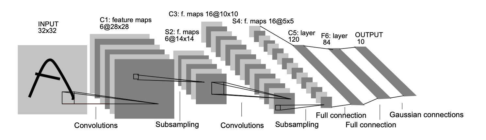

.. _header-n0:

LeNet-5
=======

.. _header-n3:

Gradient-based learning applied to document recognition
-------------------------------------------------------

.. _header-n4:

LeNet-5 结构分析
~~~~~~~~~~~~~~~~

:math:`输入-卷积-池化-卷积-池化-卷积(全连接)-全连接-全连接(输出)`

**各层网路结构和参数：**

-  输入层

   -  32 x 32 x 1

-  C1 层

   -  卷积层

   -  输入: 32 x 32 x 1

      -  滤波器大小: 5 x 5 x 1

      -  滤波器个数: 6

   -  输出: 28 x 28 x 6【TODO】

   -  参数个数: 5 x 5 x 1 x 6 = 156

-  P2 层

   -  池化层

   -  输入: 28 x 28 x 6

      -  滤波器大小: 2 x 2

      -  滤波器个数: 6

   -  输出: 14 x 14 x 6

   -  参数个数: 2 x 6 = 12【TODO】

   -  平均池化

-  C3 层

   -  卷积层

   -  输入: 14 x 14 x 6

      -  滤波器大小: 5 x 5 x 6

      -  滤波器个数: 16

   -  输出: 10 x 10 x 16

   -  参数个数: 5 x 5 x 6 x 16 = 2416

-  P4 层

   -  池化层

   -  输入: 10 x 10 x 16

      -  滤波器: 2 x 2

      -  滤波器个数: 16

   -  输出: 5 x 5 x 16

   -  参数个数: 2 x 16 = 32

   -  平均池化

-  C5 层

   -  论文中是个卷积层，但滤波器大小为 5 x
      5，所以其本质上是个全连接层。如果将 5 x 5 x 16
      拉成一个向量，它就是一个全连接层。

   -  输入: 5 x 5 x 16

      -  滤波器大小: 5 x 5 x 16

      -  滤波器个数: 120

   -  输出: 1 x 1 x 120

   -  参数个数: 5 x 5 x 16 x 120 + 120 = 48120

-  F6 层

   -  全连接层

      -  激活函数: :math:`tanh`

   -  输入: 120

   -  输出: 84

   -  参数个数: 120 x 84 + 84

-  F7 层

   -  全连接层，输出层

   -  输入: 84

   -  输出: 10

   -  参数个数: 84 x 10 + 10

.. _header-n125:

LeNet-5 TensorFlow 实现
~~~~~~~~~~~~~~~~~~~~~~~

步骤：

1. 定义创建输入、输出的占位符变量模块

2. 初始化各层参数模块

3. 创建前向传播模块

4. 定义模型优化迭代模块

5. 设置输入数据

.. code:: python

   import tensorflow as tf 
   import numpy as np 
   from tensorflow.examples.tutorials.mnist import input_data

.. code:: python

   def create_placeholder():
   	X = tf.placeholder(tf.float32, shape = (None, 28, 28))
   	Y = tf.placeholder(tf.float32, shape = (None, 10))
   	keep_prob = tf.placeholder(tf.float32)
   	return X, Y, keep_prob

.. code:: python

   def main():
   	mnist = input_data.read_data_sets("./data/", one_hot = True)
   	batch_size = 128
   	learning_rate = 0.001
   	display_step = 10
   	test_step = 5000
   	num_steps = 10000
   	dropout = 0.5
   	l2_lambda = 0.0001
   	lenet_model()
   	

   if __init__ == "__main__":
   	main()

.. _header-n143:

Reference
---------

`IEEE: Gradient-based learning applied to document
recognition <http://yann.lecun.com/exdb/publis/pdf/lecun-01a.pdf>`__
