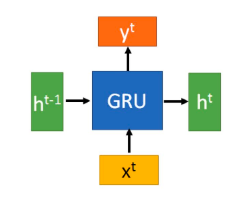
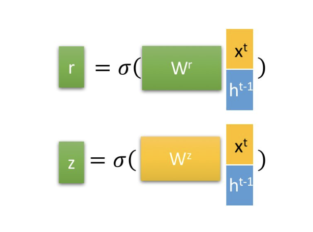
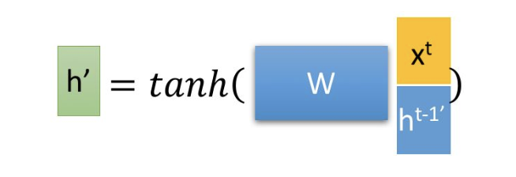
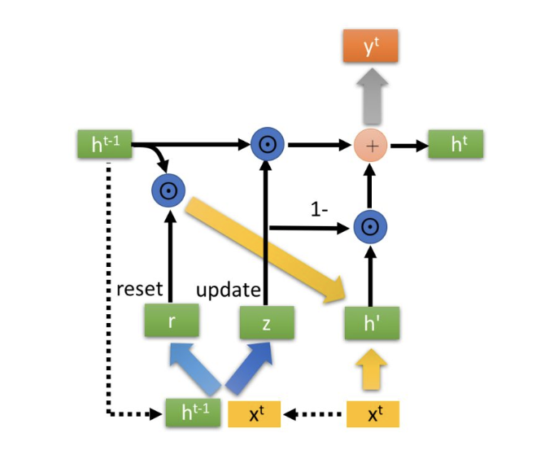

.. _header-n0:

RNN-GRU
=======

.. _header-n3:

2.3 GRU
-------

GRU (Gate Recurrent Unit) 是循环神经网络的一种变体。和 LSTM 一样，GRU
也是为了解决长期记忆和反向传播中出现的梯度消失和梯度爆炸问题而提出来的。GRU
和 LSTM 在很多种情况下实际表现相差无几，但 GRU
更容易训练，能够很大程度上提高训练效率。

.. _header-n5:

GRU 结构
~~~~~~~~

**GRU 神经元：**

GRU 的输入输出结构与普通的 RNN 一样，有一个 :math:`x^{t}` 和
上一个节点传递下来的隐状态(hidden state)
:math:`h^{t-1}`\ ，这个隐状态包含了之前节点的相关信息。结合
:math:`x^{t}` 和 :math:`h^{t-1}`\ ，GRU 会得到当前隐藏节点的输出
:math:`y^{t}` 和传递给下一个节点的隐状态 :math:`h^{t}`.

**GRU r, z 门控：**

输入：从上一个神经单元传输下来的状态来获取两个门控状态

:math:`h^{t-1}`

:math:`x^{t}`

输出：

:math:`r = \sigma(W^{r} (x^{t}, h^{t-1})^{T})`

:math:`z = \sigma(W^{z} (x^{t}, h^{t-1})^{T})`

其中：

-  :math:`\sigma(\cdot) = \frac{1}{1+e^{-x}}`

**GRU 层次结构：**

得到门控信号之后，首先使用重置门控来得到“重置”之后的数据
:math:`h^{t-1 '} = h^{t-1} \odot r`\ ，再将 :math:`h^{t-1 '}` 与输入
:math:`x^{t}`\ ，再通过一个 :math:`tanh` 激活函数来将数据缩放到
:math:`[-1, 1]` 的范围内。即得到：

这里的 :math:`h^{'}` 主要是包含了当前输入的 :math:`x^{t}`
数据。有针对性地对 :math:`h^{'}`
添加到当前的隐藏状态，相当于“记忆了当前时刻的状态”。类似于 LSTM
的选择记忆阶段。

其中：

-  :math:`\odot` 是 Hadamard Product，操作矩阵中对应的元素相乘

-  :math:`\oplus` 是矩阵加法操作

**GRU 更新记忆：**

在这个阶段，同时进行了遗忘了记忆两个步骤。我们使用了先前得到的门控
:math:`z` (update gate):

:math:`h^{t} = z \odot h^{t-1} + (1-z)\odot h^{'}`

首先再次强调一下，门控信号(这里的 :math:`z`) 的范围为
:math:`[0, 1]`\ 。门控信号接近1，代表“记忆”下来的数据越多，而接近 0
则代表“遗忘”的越多。

GRU 很聪明的一点就在于，我们使用了同一个门控 :math:`z`
就同时可以进行遗忘和选择记忆(LSTM则要使用多个门控)。

-  :math:`z \odot h^{t-1}`\ ：表示对原本隐藏状态的选择性“遗忘”。这里的
   :math:`z` 可以想象成遗忘门 (forget gate)，忘记 :math:`h^{t-1}`
   维度中一些不重要的信息；

-  :math:`(1-z) \odot h^{'}`\ ：表示对包含当前节点信息的 :math:`h^{'}`
   进行选择性“记忆”。与上面类似，这里的 :math:`(1-z)` 同理会忘记
   :math:`h^{'}` 维度中的一些不重要的信息。或者，这里我们更应当看作是对
   :math:`h^{'}` 维度中的某些信息进行选择。

-  :math:`h^{t}=z\odot h^{t-1} + (1-z)\odot h^{'}`\ ：结合上述，这一步的操作就是忘记传递下来的
   :math:`h^{t-1}` 中的某些维度信息，并加入当前节点输入的某些维度信息。

这里的遗忘 :math:`z` 和选择 :math:`(1-z)`
是联动的。也就是说，对于传递进来的维度信息，我们会进行选择性遗忘，则遗忘了多少权重
:math:`(z)`\ ，我们就会使用包含当前输入的 :math:`(h^{'})`
中所对应的权重进行弥补 :math:`(1-z)` 。以保持一种“恒定”状态。

那么这里的 :math:`h^{'}` 实际上可以看成对应于 LSTM 中的 hidden
state；上一个节点传下来的 :math:`h^{t-1}` 则对应于 LSTM 中的 cell
state。\ :math:`z` 对应的则是 LSTM 中的 :math:`z^{f}` forget gate，那么
:math:`(1-z)` 我们似乎就可以看成是选择门 :math:`z^{i}` 了.

GRU输入输出的结构与普通的RNN相似，其中的内部思想与LSTM相似。

与LSTM相比，GRU内部少了一个”门控“，参数比LSTM少，但是却也能够达到与LSTM相当的功能。考虑到硬件的计算能力和时间成本，因而很多时候我们也就会选择更加”实用“的GRU啦。
